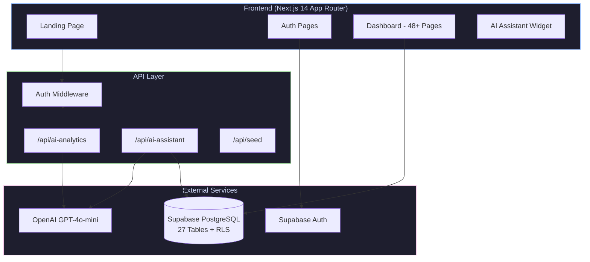

<p align="center">
  
  
  
  
  
</p>

# ScholarSync - AI-Powered School Management Platform

**ScholarSync** is a comprehensive, AI-enhanced school management system built for the modern education ecosystem. It streamlines administrative workflows, empowers educators with data-driven insights, and keeps parents connected — all from a single platform.

## Problem Statement

Schools struggle with fragmented tools for attendance, grades, fees, library, transport, and communication. Administrators lack real-time visibility into student performance trends, and at-risk students often go unnoticed until it's too late.

## Solution

ScholarSync unifies **23+ modules** under one platform with **AI-powered analytics** that proactively identifies at-risk students, predicts attendance trends, and recommends personalized interventions — turning reactive school management into proactive student success.

---

## Architecture



## Features

### Core Modules (23+)

| Category | Modules |
|----------|---------|
| **Academic** | Students, Teachers, Grades, Examinations, Timetable, Attendance |
| **Administrative** | Admissions, Fees & Payments, Payroll, Inventory, Certificates |
| **Communication** | Announcements, Messages, Notifications, Events |
| **Facilities** | Library (issue/return/fines), Transport Routes, Hostel & Mess Management |
| **Intelligence** | AI Analytics Dashboard, AI Assistant Chatbot, Reports & Data Export |
| **Security** | Audit Logs, Role-Based Access Control, Row-Level Security |

### AI-Powered Analytics

- **Student Risk Scoring** — Weighted algorithm (40% attendance, 60% grades) auto-classifies students as Low/Medium/High risk
- **Predictive Insights** — GPT-4o-mini analyzes school-wide data to predict attendance trends and academic outlook
- **Personalized Interventions** — AI generates specific, actionable recommendations per at-risk student
- **Executive Summaries** — One-click AI-generated reports for administrators

### AI Assistant Chatbot

- Context-aware: pulls live school data (students, teachers, events, announcements)
- Multi-turn conversation with 6-message history
- Helps navigate modules and answers school operations questions

### Security & Access Control

- **3-tier RBAC**: Admin, Teacher, Parent — each with tailored dashboards and permissions
- **Row-Level Security (RLS)**: 28 Supabase policies ensure data isolation at the database level
- **Middleware-based route protection** with automatic redirects

### Multi-Language Support

- English and Hindi (हिन्दी) with real-time switching
- Context-based i18n architecture — easily extensible to more languages

### Additional Highlights

- Dark/Light/System theme support
- Fully responsive (mobile, tablet, desktop)
- CSV export for students, attendance, grades, and payments
- CSV import for bulk data upload
- Real-time toast notifications with Sonner
- Interactive charts with Recharts (Area, Bar, Pie)

---

## Tech Stack

| Layer | Technology |
|-------|-----------|
| **Framework** | Next.js 14 (App Router, Server Components) |
| **Language** | TypeScript 5 (strict mode) |
| **Database** | Supabase (PostgreSQL) — 27 tables, RLS policies |
| **Auth** | Supabase Auth (session-based with SSR middleware) |
| **AI** | OpenAI GPT-4o-mini |
| **UI** | Tailwind CSS + shadcn/ui + Radix UI primitives |
| **Charts** | Recharts 3.8 |
| **Testing** | Jest + Testing Library (unit) / Playwright (E2E) |
| **Deployment** | Vercel |

---

## Database Schema

27 tables organized across 5 domains:

```
Core:        profiles, students, classes, academic_years, subjects, class_subjects
Academic:    attendance, grades, assignments, examinations, exam_results, timetables
Admin:       admissions, fee_structures, fee_payments, payroll, inventory_items
Facilities:  library_books, book_issues, transport_routes, transport_assignments,
             hostel_rooms, hostel_allocations, events
Communication: announcements, messages
```

All tables use UUID primary keys, timestamps, and foreign key constraints. RLS is enabled on every table with role-based policies.

---

## Getting Started

### Prerequisites

- Node.js 18+
- npm or yarn
- Supabase project (free tier works)
- OpenAI API key

### Installation

```bash
# Clone the repository
git clone https://github.com/AI-Kurukshetra/scholarsync.git
cd scholarsync

# Install dependencies
npm install

# Set up environment variables
cp .env.example .env.local
# Edit .env.local with your Supabase and OpenAI credentials

# Run database migrations
# Apply supabase/schema.sql and migrations in your Supabase dashboard

# Seed the database (optional)
npm run dev
# Then POST to /api/seed

# Start development server
npm run dev
```

Open [http://localhost:3000](http://localhost:3000) to see the app.

### Demo Credentials

| Role | Email | Password |
|------|-------|----------|
| Admin | admin@scholarsync.com | admin123 |
| Teacher | teacher@scholarsync.com | teacher123 |
| Parent | parent@scholarsync.com | parent123 |

---

## Testing

```bash
# Unit tests
npm test

# E2E tests (headless)
npm run test:e2e

# E2E tests (interactive UI)
npm run test:e2e:ui
```

- **15 unit tests** covering core UI components (Button, Card, Sidebar, RoleGate, etc.)
- **11 E2E test suites** covering authentication, navigation, and all major workflows

---

## Project Structure

```
src/
├── app/
│   ├── (auth)/              # Login & Signup pages
│   ├── (dashboard)/         # 23 protected module pages
│   │   ├── analytics/       # AI-powered analytics dashboard
│   │   ├── students/        # Student CRUD + profiles
│   │   ├── attendance/      # Interactive attendance marking
│   │   ├── grades/          # Grade management
│   │   ├── fees/            # Fee tracking & payments
│   │   ├── certificates/    # Auto-generated certificates
│   │   ├── audit-logs/      # Admin activity tracking
│   │   └── ...              # 16 more modules
│   └── api/
│       ├── ai-analytics/    # GPT-powered risk analysis
│       └── ai-assistant/    # Context-aware chatbot
├── components/
│   ├── shared/              # App shell, sidebar, topbar, AI widget
│   └── ui/                  # shadcn component library
├── lib/
│   ├── auth.ts              # Auth helpers (getUser, requireRole)
│   ├── supabase/            # Client & middleware setup
│   └── i18n/                # Translation system (EN/HI)
└── __tests__/               # Jest unit tests
e2e/                         # Playwright E2E tests
supabase/
├── schema.sql               # Full database schema (27 tables)
└── migrations/              # Incremental migrations
```

---

## API Endpoints

### POST `/api/ai-analytics`

Analyzes student data and returns AI-generated insights.

**Request:**
```json
{
  "students": [{ "name": "...", "attendanceRate": 85, "avgGrade": 72, "riskScore": 0.6 }],
  "classPerformance": [{ "name": "Class 10A", "attendance": 88, "grades": 75 }],
  "summary": { "totalStudents": 150, "atRisk": 12, "avgAttendance": 87 }
}
```

**Response:**
```json
{
  "success": true,
  "insights": {
    "overallInsight": "Executive summary...",
    "keyFindings": ["..."],
    "recommendations": [{ "priority": "high", "action": "...", "impact": "..." }],
    "studentInsights": [{ "name": "...", "insight": "..." }],
    "predictions": { "attendanceTrend": "...", "academicOutlook": "...", "interventionUrgency": "..." }
  }
}
```

### POST `/api/ai-assistant`

Context-aware chatbot that pulls live school data.

**Request:**
```json
{
  "message": "How many students are at risk?",
  "history": [{ "role": "user", "content": "..." }]
}
```

**Response:**
```json
{
  "success": true,
  "reply": "Based on current data, 12 out of 150 students are flagged as at-risk..."
}
```

---

## Contributing

See [CONTRIBUTING.md](CONTRIBUTING.md) for development guidelines.

## License

This project is licensed under the MIT License — see [LICENSE](LICENSE) for details.

---

<p align="center">
  Built with Next.js + Supabase + OpenAI for <strong>AI Kurukshetra Hackathon</strong>
</p>
